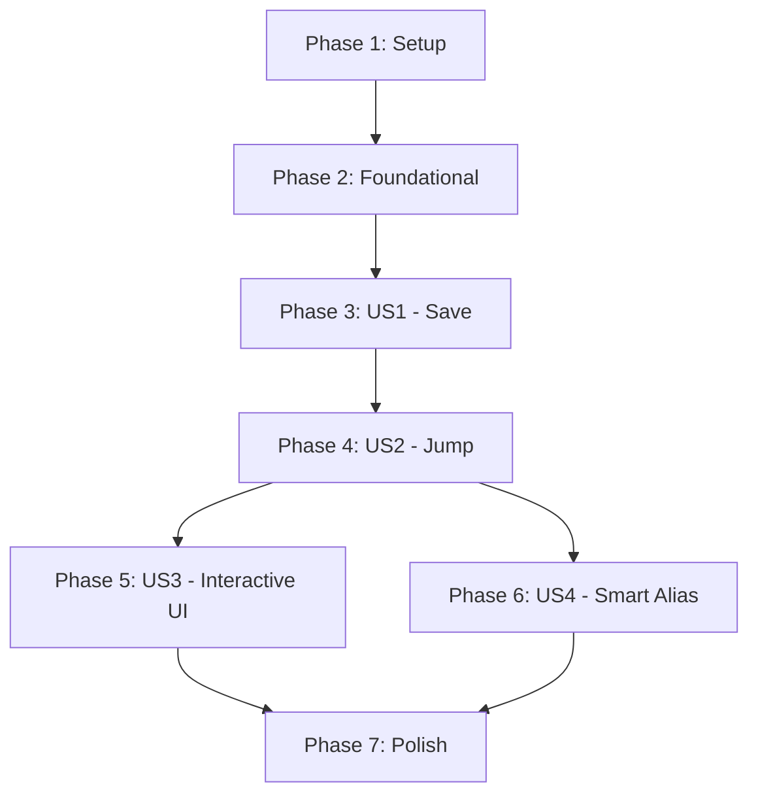

# Tasks: onw-cli-jump

**Input**: Design documents from `/specs/001-onw-cli-jump/`
**Prerequisites**: plan.md, spec.md, research.md, data-model.md, contracts/

## Format: `[ID] [P?] [Story] Description`

- **[P]**: Can run in parallel (different files, no dependencies)
- **[Story]**: Which user story this task belongs to (e.g., US1, US2, US3)
- Include exact file paths in descriptions

## Phase 1: Setup (Shared Infrastructure)

**Purpose**: Project initialization and basic structure

- [x] T001 Create project structure per implementation plan (src/, tests/, etc.)
- [x] T002 Initialize Node.js project (ESM) with `ink`, `react`, `meow`, `conf` dependencies
- [x] T003 [P] Configure TypeScript and linting/formatting (eslint/prettier)

---

## Phase 2: Foundational (Blocking Prerequisites)

**Purpose**: Core infrastructure for storage and CLI dispatching

**⚠️ CRITICAL**: No user story work can begin until this phase is complete

- [x] T004 Implement storage layer using `conf` in `src/storage/config.ts`
- [x] T005 Setup base CLI entry point using `meow` in `src/cli/index.ts`
- [x] T006 Implement shell integration function in `contracts/shell.sh` (for user installation)
- [x] T007 [P] Create base `AliasEntry` type definition in `src/core/types.ts`

**Checkpoint**: Foundation ready - storage and CLI dispatching are functional.

---

## Phase 3: User Story 1 - Save and Alias Current Directory (Priority: P1) 🎯 MVP

**Goal**: Allow users to bookmark directories with a custom alias.

**Independent Test**: Run `onw my-alias --here` and verify `~/.magic/onw/config.json` contains the current path mapped to `my-alias`.

### Implementation for User Story 1

- [x] T008 [P] [US1] Implement path validation logic in `src/core/validation.ts`
- [x] T009 [US1] Implement `bookmark` service in `src/core/bookmarks.ts` to save path/alias pairs
- [x] T010 [US1] Add `--here` flag and alias argument handling in `src/cli/index.ts`
- [x] T011 [US1] Connect CLI to bookmark service in `src/index.ts`
- [x] T012 [US1] Implement success/error output to stderr in `src/core/output.ts`

**Checkpoint**: User Story 1 is functional. Users can save aliases.

---

## Phase 4: User Story 2 - Jump to Directory via Alias (Priority: P1) 🎯 MVP

**Goal**: Allow users to jump to a saved directory using its alias.

**Independent Test**: Run `onw my-alias` and verify the output is `__jump__:<path>`.

### Implementation for User Story 2

- [x] T013 [US1] [US2] Implement alias resolution logic in `src/core/bookmarks.ts`
- [x] T014 [US2] Implement jump signal output (`__jump__:<path>`) in `src/core/output.ts`
- [x] T015 [US2] Update `lastUsed` timestamp in `AliasEntry` upon successful jump in `src/core/bookmarks.ts`
- [x] T016 [US2] Add alias argument handling for jumps in `src/cli/index.ts`

**Checkpoint**: User Story 2 is functional. Users can jump to saved aliases.

---

## Phase 5: User Story 3 - Interactive Navigation and Search (Priority: P2)

**Goal**: Provide a searchable terminal UI for selecting and managing bookmarks.

**Independent Test**: Run `onw` (no args) and verify the interactive list appears and filters as you type.

### Implementation for User Story 3

- [x] T017 [US3] Create base Ink UI wrapper in `src/ui/index.tsx`
- [x] T018 [P] [US3] Create `ListView` component in `src/ui/views/ListView.tsx`
- [x] T019 [P] [US3] Create `SearchInput` component in `src/ui/components/SearchInput.tsx`
- [x] T020 [US3] Implement list filtering logic in `src/ui/hooks/useFilter.ts`
- [x] T021 [US3] Implement deletion logic (selectable in UI) in `src/ui/views/ListView.tsx`
- [x] T022 [US3] Ensure all UI rendering goes to **stderr** to avoid interfering with stdout jump signals
- [x] T023 [US3] Map `Enter` key to jump signal and `Esc` to exit in `src/ui/views/ListView.tsx`

**Checkpoint**: User Story 3 is functional. Interactive UI is available.

---

## Phase 6: User Story 4 - Smart Alias Generation (Priority: P3)

**Goal**: Automatically generate food-themed aliases when none are provided.

**Independent Test**: Run `onw --here` (no alias) and verify a random food word is used as the alias.

### Implementation for User Story 4

- [x] T024 [P] [US4] Create food-themed word list in `src/core/words.ts`
- [x] T025 [US4] Implement random alias generator in `src/core/bookmarks.ts`
- [x] T026 [US4] Handle conflict resolution (append random number if word taken) in `src/core/bookmarks.ts`
- [x] T027 [US4] Update CLI to trigger auto-generation when alias is missing for `--here` or `-p`

**Checkpoint**: User Story 4 is functional. Auto-alias generation works.

---

## Phase 7: Polish & Cross-Cutting Concerns

**Purpose**: Final documentation, sort orders, and robustness.

- [x] T028 [US3] Implement recency sorting (`-r` flag) in `src/core/bookmarks.ts` and UI
- [x] T029 Add comprehensive help text and `-h`/`--help` implementation in `src/cli/index.ts`
- [ ] T030 [P] Add unit tests for core bookmark logic in `tests/unit/bookmarks.test.ts`
- [ ] T031 Add integration tests for CLI flags in `tests/integration/cli.test.ts`
- [ ] T032 Verify shell integration works across different environments (Bash/Zsh)

## Dependency Graph

## Parallel Execution Examples

- **US1 & US2 Foundations**: T008, T013 can be worked on concurrently as they relate to logic in `bookmarks.ts`.
- **UI Components**: T018 and T019 can be developed in parallel as separate React components.
- **Word List**: T024 can be created anytime before T025.

## Implementation Strategy

1. **MVP First**: Focus on Phase 1 through Phase 4 to deliver a functional "Save and Jump" CLI.
2. **Incremental UI**: Add the interactive list (Phase 5) once the core jump logic is solid.
3. **Fun Polish**: Add the food-themed aliases (Phase 6) and sorting (Phase 7) last.
