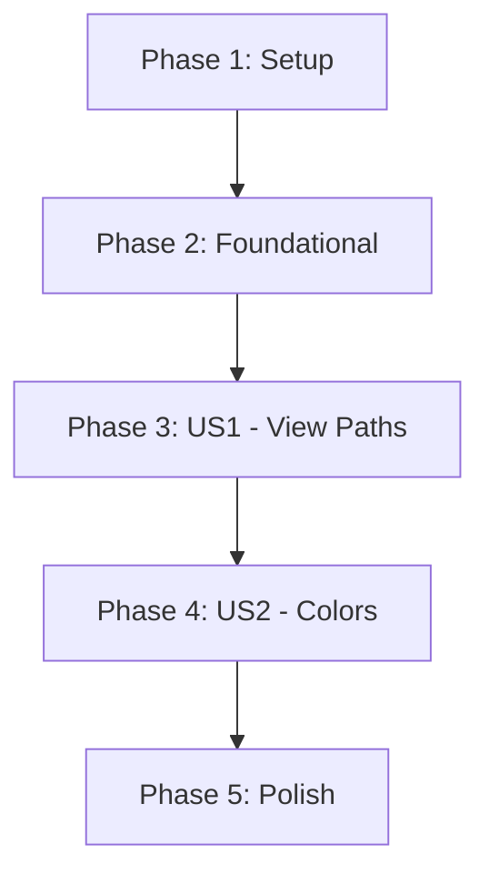

# Tasks: ui-visual-enhancements

**Input**: Design documents from `/specs/002-ui-visual-enhancements/`
**Prerequisites**: plan.md, spec.md, research.md, data-model.md, contracts/

## Format: `[ID] [P?] [Story] Description`

- **[P]**: Can run in parallel (different files, no dependencies)
- **[Story]**: Which user story this task belongs to (e.g., US1, US2, US3)
- Include exact file paths in descriptions

## Phase 1: Setup (Shared Infrastructure)

**Purpose**: Initial environment check

- [x] T001 Verify project structure and existing UI components in \`src/ui/\` are ready for modification

---

## Phase 2: Foundational (Blocking Prerequisites)

**Purpose**: Core utility logic for UI rendering

**⚠️ CRITICAL**: These tasks must be completed before UI components can be updated

- [x] T002 Implement \`truncatePath\` utility with end-truncation logic (\`...\in \`src/core/validation.ts\` (or new \`src/core/ui-utils.ts\`)
- [x] T003 Create \`src/core/theme.ts\` to store standard ANSI color constants (\`green\`, \`gray\`, \`cyan\`) per data model

**Checkpoint**: Foundational logic ready.

---

## Phase 3: User Story 1 - View Paths in Interactive List (Priority: P1) 🎯 MVP

**Goal**: Display alias and path on the same line with column alignment.

**Independent Test**: Run \`onw\` and verify each item shows the alias followed by the path, aligned in columns.

### Implementation for User Story 1

- [x] T004 Create custom list item component in \`src/ui/components/CustomItem.tsx\` to render alias and path
- [x] T005 [P] Implement column alignment using flexbox in \`src/ui/components/CustomItem.tsx\` (fixed width for alias)
- [x] T006 [P] Integrate \`truncatePath\` utility into \`src/ui/components/CustomItem.tsx\` to handle narrow terminals (FR-006)
- [x] T007 Update \`src/ui/views/ListView.tsx\` to use \`CustomItem\` as the \`itemComponent\` for \`SelectInput\`

**Checkpoint**: User Story 1 is functional. Paths are visible and aligned.

---

## Phase 4: User Story 2 - Visual Distinction via Colors (Priority: P2)

**Goal**: Apply colorful ANSI themes to the interactive UI.

**Independent Test**: Run \`onw\` and verify colors are applied to search bar, aliases, paths, and selection.

### Implementation for User Story 2

- [x] T008 [P] Update \`src/ui/components/SearchInput.tsx\` to use \`cyan\` for borders and search prompt (FR-004)
- [x] T009 Update \`src/ui/components/CustomItem.tsx\` to apply \`green\` to aliases and \`gray\` to paths (FR-003)
- [x] T010 Implement selection highlight style (bold/blue) in \`src/ui/components/CustomItem.tsx\` (FR-005)

**Checkpoint**: User Story 2 is functional. UI is colorful and scannable.

---

## Phase 5: Polish & Cross-Cutting Concerns

**Purpose**: Final verification and robustness.

- [x] T011 Verify all UI rendering goes to **stderr** in \`src/ui/index.tsx\` to avoid stdout pollution (Contract)
- [x] T012 [P] Add unit tests for \`truncatePath\` logic in \`tests/unit/ui-utils.test.ts\`
- [x] T013 Verify UI readability on both Dark and Light terminal themes

## Dependency Graph

## Parallel Execution Examples

- **Foundational Utilities**: T002 and T003 can be developed concurrently.
- **Component Updates**: T005 and T006 can be worked on within the same file (`CustomItem.tsx`) but represent independent logic blocks.
- **Color Application**: T008 can be done in parallel with T009 as they affect different files.

## Implementation Strategy

1. **MVP First**: Deliver User Story 1 to provide the functional value of seeing paths immediately.
2. **Visual Layer**: Apply colors and highlights in Phase 4 once the layout is stable.
3. **Robustness**: Finalize truncation and stderr checks in the polish phase.
